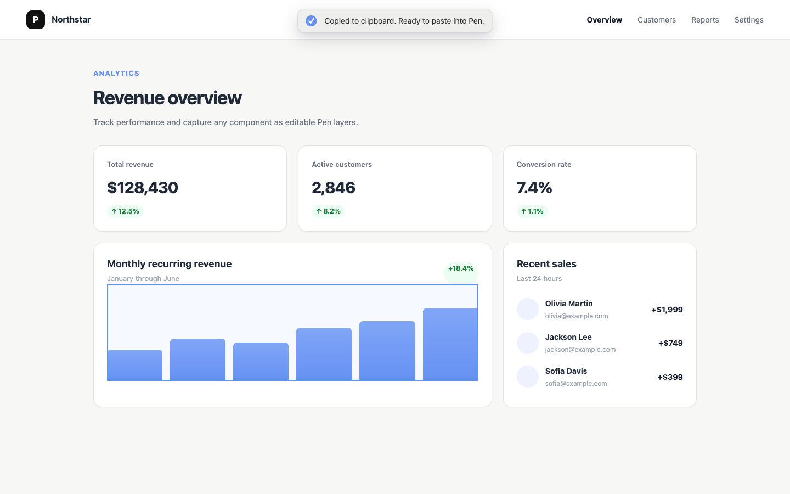

# Pen Capture

Capture rendered web elements and paste them as editable layers directly in Pen.

The project contains a browser-side capture library, a Chrome Manifest V3 extension with a Paper-like picker, a deterministic converter and CLI, an Agent Skill for Codex, Claude Code and Grok, and `examples.pen` for integration tests.

## Extension interaction

Click the extension icon to enter capture mode. The page gets a floating toolbar and a blue outline around the current target.

### 1. Select an element

Move the pointer over the element you want to bring into Pen. The blue outline shows the exact DOM subtree that will be captured; use the arrow keys to fine-tune the selection when needed.


### 2. Copy it for Pen

Click the highlighted element or press `Enter`. Once the toolbar confirms the copy, switch to Pen and paste to get editable layers.



- Move the pointer to choose an element.
- Click or press `Enter` to capture it.
- Press `↑` to select its parent.
- Press `↓` to return to the previously selected child, or its first child.
- Press `Cmd + Enter` on macOS or `Ctrl + Enter` elsewhere to capture the whole page.
- Press `Esc` to cancel.

The toolbar fades while the pointer is over it so content underneath remains selectable. The extension converts the selected DOM subtree into editable Pen nodes and writes Pen's native `data-pen-node-clipboard` `text/html` payload to the clipboard. No page data is transmitted.

The picker follows live DOM updates between hover and click. It recovers a selected element after a framework rerender and uses a short-lived private marker to preserve the exact node across Chrome's isolated and main execution worlds.

Capture mode is installed in every accessible frame. Entering an iframe activates its local picker and hides the parent picker, so selection, keyboard navigation and capture operate against the iframe's own DOM without stacked toolbars. Clipboard writing is delegated to a private offscreen extension document, which also supports cross-origin frames whose page-level clipboard policy would otherwise reject the capture. The payload remains inside the extension and is not transmitted.

During serialization the toolbar collapses to `Capturing selection…` or `Capturing page…`. A neutral background fill and percentage advance while the capture is running, stop below completion until the real work finishes, and reach `100%` only after the browser confirms that the `text/html` payload was written. The toolbar then switches to `Copied to clipboard. Ready to paste into Pen.`.

Direct extension paste runs in Pen-safe asset mode. Remote `http(s)` images remain image fills, redirects are resolved before the URL reaches Pen, and the clipboard never contains `data:` image URLs: Pen Desktop 1.1.70 treats non-HTTP image values as filesystem paths, so an embedded base64 URL opens a large asset-error alert. Supported `brightness()` and `grayscale()` filters become editable overlay layers; CSS color blend overlays become Pen blend fills. Canvas snapshots have no durable browser URL and therefore become a transparent `Canvas · Materialization required` frame with diagnostic metadata.

Before serialization, the extension waits for SVG geometry to stabilize so animated Recharts paths are not copied mid-transition. The color converter supports the computed `rgb()`, `oklab()`, `oklch()` and `lab()` forms used by current Tailwind/shadcn output, including small empty status bullets. Transparent CSS gradients are layered above their background color instead of replacing it. SVG `linearGradient` paint servers preserve their stops and combined opacity; sharp repeating-linear patterns become clipped editable vector strokes so their spacing remains uniform in Pen.

Visible text truncation is preserved as editable content. Multi-line `-webkit-line-clamp` regions discard hidden lines and append `...` to the last visible run, while single-line `text-overflow: ellipsis` labels receive the marker only when their measured content actually overflows.

The neutral `*.capture.json` IR and conversion CLI remain available for diagnostics, repeatable MCP imports, and regression tests. They are no longer the extension's clipboard format.

For durable, maximum-fidelity project captures, set `PEN_CAPTURE_MATERIALIZE_DIR` while running the clipboard smoke workflow or use the CLI/MCP import. Image and canvas fills are downloaded or decoded into project-local files, and the clipboard payload is rewritten to use paths relative to the `.pen` document. This is the required path when canvas pixels or filtered raster output must be preserved.

The Chrome icon sizes are rendered from the official [pen.dev app icon](https://www.pen.dev/apple-touch-icon.png).

## Clipboard compatibility

The extension's clipboard envelope mirrors the native format produced by Pen itself, while the neutral capture IR and conversion pipeline remain testable outside the extension.

After rebuilding, reload the unpacked extension in `chrome://extensions` before testing changes to its clipboard behavior.

## Development

```sh
bun test
bun run build
bun run smoke:iframe
bun run smoke:extension-iframe
```

Load `dist/extension` as an unpacked extension from `chrome://extensions`.

## Agent Skill

The canonical Agent Skills package lives in `skills/pen-capture` and can be discovered directly from this GitHub repository. Install it globally for Codex and Claude Code with the open `skills` CLI:

```sh
npx skills add djalmajr/pen-capture --skill pen-capture -g -a codex -a claude-code -y
```

Grok reads Claude Code skills automatically, so the Claude installation above is also the Grok-compatible installation. To keep an explicit Grok-only copy instead, install with the CLI and copy the canonical skill folder to `~/.grok/skills/pen-capture`.

List what the repository exposes without installing anything:

```sh
npx skills add djalmajr/pen-capture --list
```

## CLI

```sh
bun bin/pen-capture.mjs verify path/to/card.capture.json
bun bin/pen-capture.mjs convert path/to/card.capture.json /tmp/card.pen-tree.json
bun run smoke:clipboard
bun run smoke:preview-02
bun bin/pen-capture.mjs batch /tmp/card.pen-tree.json /tmp/card.batch.js
```

The generated batch is intended for Pen MCP `batch_design`. The CLI never writes `.pen` files directly.

## Acceptance suite

The two shadcn amber/olive previews in [`fixtures/shadcn/catalog.json`](fixtures/shadcn/catalog.json) are the initial acceptance suite. Each direct column child is captured independently so keyboard selection does not accidentally choose an entire source column. The suite currently contains 61 visible blocks; one `display:none` duplicate is recorded and excluded.

Absolute positions are retained for fidelity, but the original DOM parent/child hierarchy is reconstructed with coordinates relative to each semantic frame. HTML backgrounds, text, form values, SVG paths and common SVG primitives remain editable. ``, CSS image backgrounds and canvas content use Pen image fills; remote assets are inlined when possible. Linear CSS and SVG gradients become native Pen gradients; sharp repeating-linear patterns become clipped editable vector strokes. Auto Layout inference, pseudo-elements, masks and component recognition remain explicit follow-up capabilities.

`examples.pen` currently contains the consolidated `preview` capture. The `preview-02` capture is intentionally gated until the first reference is visually approved. The CLI never edits `.pen` files directly; generated batches are applied through Pen MCP.

Pen currently needs nested catalog captures to be materialized once with `Copy` after insertion. Because copying regenerates descendant IDs, the import workflow finishes by querying the copied subtree and normalizing every layer to `Name (#currentId)`.

## Visual comparison

The acceptance flow produces a browser screenshot, exports the corresponding Pen frame as PNG through Pen MCP and generates a deterministic ImageMagick report:

```sh
bun run capture:source -- <url> <selector> artifacts/source.png
bun run compare:visual -- artifacts/source.png artifacts/pen.png artifacts/comparison
bun run compare:visual -- artifacts/source.png artifacts/pen.png artifacts/comparison --require-same-size --max-rmse 0.10
```

The source capture waits for network idle, web fonts, reduced motion and a configurable settle interval (`PEN_CAPTURE_SETTLE_MS`, default `500`). The comparison output includes `report.json`, `report.html`, `side-by-side.png`, `diff.png` and the normalized Pen render used for pixel comparison. Acceptance flags make the command exit unsuccessfully if dimensions differ or normalized RMSE exceeds the declared limit.

Current per-page evidence and known residual differences are recorded under [`docs/acceptance`](docs/acceptance).
